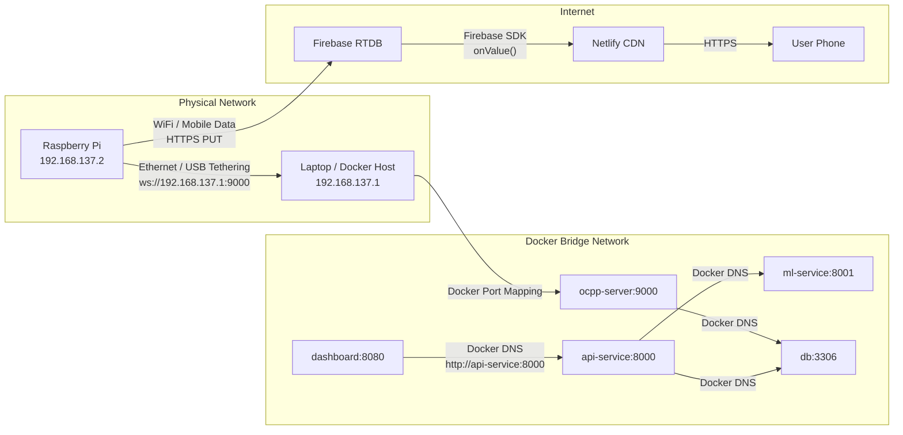
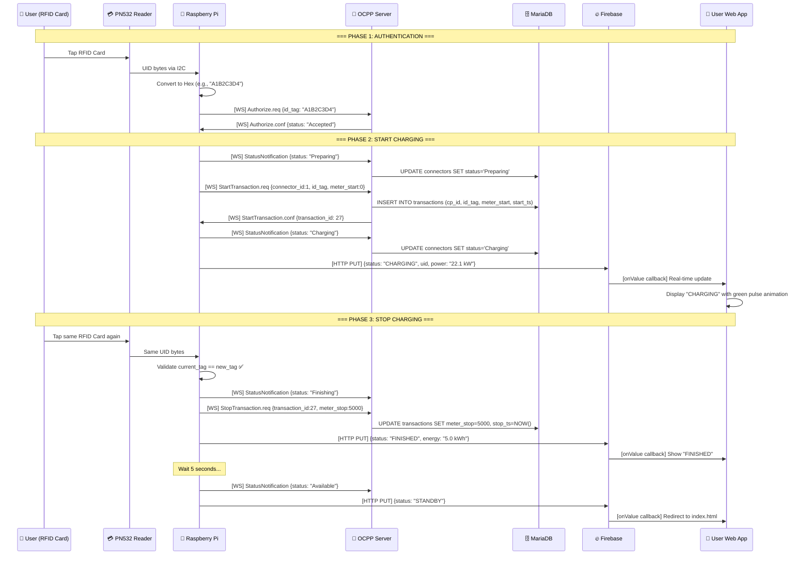
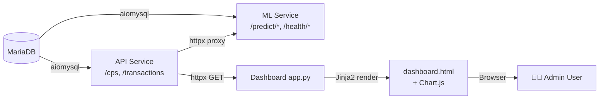
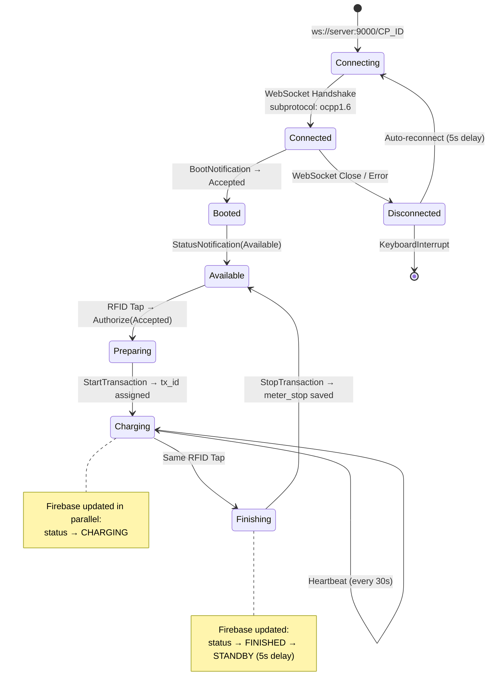
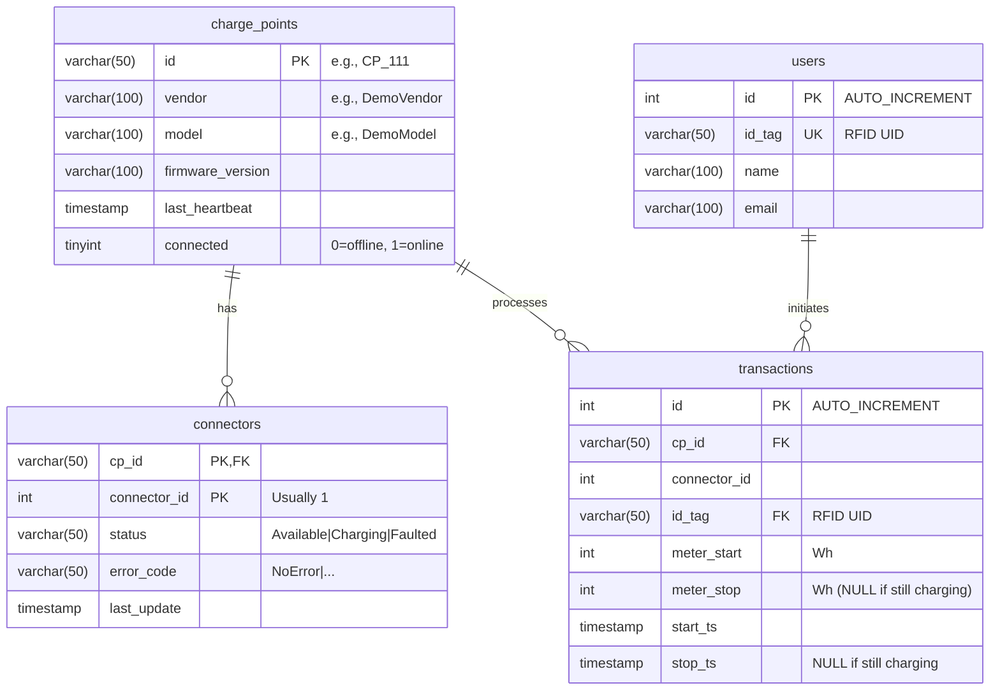
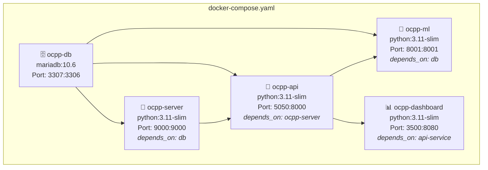
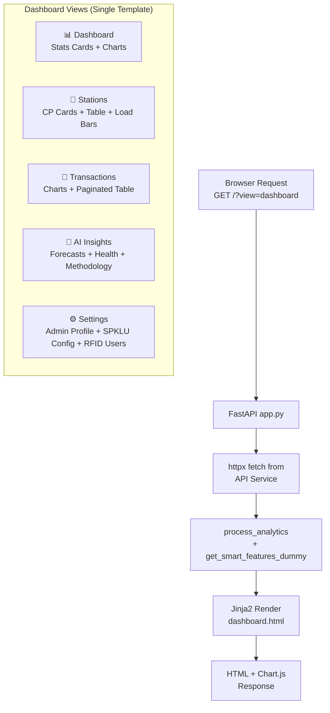

# 🏗️ System Architecture — Charge-IT CSMS

> Deep Technical Dive into the Hybrid Edge-Core-Cloud Architecture for the Integrated Smart EV Charging Ecosystem.

---

## 📋 Table of Contents

- [High-Level Architecture](#-high-level-architecture)
- [Layer Breakdown](#-layer-breakdown)
- [Network Topology](#-network-topology)
- [Data Flow](#-data-flow)
- [OCPP 1.6J Protocol Implementation](#-ocpp-16j-protocol-implementation)
- [Database Schema](#-database-schema)
- [Docker Container Architecture](#-docker-container-architecture)
- [AI/ML Pipeline](#-aiml-pipeline)
- [Frontend Architecture](#-frontend-architecture)

---

## 🌐 High-Level Architecture

The system follows a **3-tier Hybrid Architecture** pattern: Edge → Core → Cloud.

```mermaid
graph TD
    subgraph "🔌 EDGE LAYER (Field)"
        RPI[🥧 Raspberry Pi 3B+]
        PN532[💳 PN532 NFC/RFID<br>I2C: SDA=GPIO2, SCL=GPIO3]
        CARD[🪪 MiFare RFID Card]
    end

    subgraph "🖥️ CORE LAYER (Local Laptop / Docker Host)"
        subgraph "Docker Network (bridge)"
            OCPP[📡 OCPP Server<br>ws://0.0.0.0:9000<br>Python + websockets]
            API[🔗 REST API<br>:5050 → :8000<br>FastAPI + aiomysql]
            DASH[📊 Dashboard<br>:3500 → :8080<br>FastAPI + Jinja2]
            ML[🤖 ML Service<br>:8001<br>FastAPI + scikit-learn]
            DB[(🗄️ MariaDB 10.6<br>:3307 → :3306<br>Database: ocpp)]
        end
    end

    subgraph "☁️ CLOUD LAYER (Internet)"
        FB[🔥 Firebase Realtime DB<br>asia-southeast1]
        NETLIFY[🌍 Netlify CDN<br>User HMI Static Site]
        USER[📱 User Mobile/Browser]
    end

    CARD -->|Tap| PN532
    PN532 -->|I2C Read UID| RPI
    RPI -->|WebSocket OCPP 1.6J<br>ws://192.168.x.x:9000/CP_ID| OCPP
    RPI -->|HTTP PUT<br>Firebase REST API| FB
    
    OCPP -->|SQL INSERT/UPDATE| DB
    API -->|SQL SELECT| DB
    API -->|HTTP GET /predict/*| ML
    ML -->|SQL SELECT| DB
    DASH -->|HTTP GET /cps, /transactions| API
    
    FB -->|onValue() listener<br>Firebase JS SDK| NETLIFY
    NETLIFY -->|HTTPS| USER

    style RPI fill:#22c55e,color:#fff
    style OCPP fill:#3b82f6,color:#fff
    style API fill:#6366f1,color:#fff
    style DASH fill:#a855f7,color:#fff
    style ML fill:#f59e0b,color:#fff
    style DB fill:#ef4444,color:#fff
    style FB fill:#f97316,color:#fff
    style NETLIFY fill:#06b6d4,color:#fff
```

---

## 🧱 Layer Breakdown

### 1. Edge Layer — Raspberry Pi (Field Device)

**Purpose:** Acts as the physical Charge Point Controller deployed at the SPKLU site.

| Component | File | Function |
|---|---|---|
| RFID Reader | `test_pn532.py` | Hardware test — reads PN532 via I2C, outputs UID hex string |
| OCPP Client (Basic) | `rfid_cp_1.py` | RFID tap → OCPP Authorize/Start/Stop → Server only |
| OCPP Client (Firebase) | `rfid_cp_1_firebase.py` | Same as above + pushes status to Firebase Realtime DB |
| OCPP Client (v2) | `rfid_cp_1_f2.py` | Enhanced version with `ping_interval=20`, ICS network (`192.168.137.1`) |

**Key Implementation Details:**
- Uses `asyncio.to_thread(pn532.read_passive_target, timeout=0.5)` to prevent I2C blocking the WebSocket event loop.
- Implements **same-card validation**: only the RFID card that started a session can stop it (`tag_id == self.current_tag`).
- Heartbeat loop runs as `asyncio.create_task()` alongside the RFID read loop.
- Auto-reconnect with 5-second retry interval on `ConnectionRefusedError`.
- Firebase update is fire-and-forget via `requests.put()` with 2-second timeout.

### 2. Core Layer — Docker Host (Local Laptop)

**Purpose:** Centralized backend providing OCPP protocol handling, data persistence, REST APIs, analytics dashboard, and ML inference.

| Container | Internal Port | External Port | Base Image |
|---|---|---|---|
| `ocpp-server` | 9000 | 9000 | python:3.11-slim |
| `ocpp-api` | 8000 | 5050 | python:3.11-slim |
| `ocpp-dashboard` | 8080 | 3500 | python:3.11-slim |
| `ocpp-ml` | 8001 | 8001 | python:3.11-slim |
| `ocpp-db` | 3306 | 3307 | mariadb:10.6 |

### 3. Cloud Layer — Firebase + Netlify

**Purpose:** Bridges real-time charging data to end-users without requiring the user's device to be on the same local network as the server.

| Service | Role | URL Pattern |
|---|---|---|
| Firebase RTDB | State synchronization store | `https://ev-tpt-default-rtdb.asia-southeast1.firebasedatabase.app/chargers/CP01` |
| Netlify | Static site hosting for User HMI | `https://tpt111-db.netlify.app` |

---

## 🌐 Network Topology



**Two Network Configurations Supported:**

| Config | Raspi IP | Laptop IP | File | Use Case |
|---|---|---|---|---|
| USB/Ethernet Direct | `192.168.55.x` | `192.168.55.10` | `rfid_cp_1.py` | Development & Testing |
| Windows ICS (Internet Connection Sharing) | `192.168.137.2` | `192.168.137.1` | `rfid_cp_1_f2.py` | Field Deployment |

---

## 🔄 Data Flow

### Complete Charging Session Flow



### Dashboard Data Flow



---

## 📡 OCPP 1.6J Protocol Implementation

### Supported Actions

The OCPP server (`server_ocpp.py`) implements the following OCPP 1.6J actions using the `@on(Action.X)` decorator pattern from the `ocpp` Python library:

| Action | Direction | Handler | Database Operation |
|---|---|---|---|
| `BootNotification` | CP → CS | `on_boot()` | `INSERT ... ON DUPLICATE KEY UPDATE` into `charge_points` |
| `Heartbeat` | CP → CS | `on_heartbeat()` | `UPDATE charge_points SET last_heartbeat=NOW(), connected=1` |
| `StatusNotification` | CP → CS | `on_status()` | `REPLACE INTO connectors` (connector_id, status, error_code) |
| `Authorize` | CP → CS | `on_authorize()` | Returns `AuthorizationStatus.accepted` (no DB check currently) |
| `StartTransaction` | CP → CS | `on_start_tx()` | `INSERT INTO transactions` → returns `transaction_id` |
| `StopTransaction` | CP → CS | `on_stop_tx()` | `UPDATE transactions SET meter_stop, stop_ts` |

### WebSocket Connection Lifecycle



### OCPP Message Format (JSON over WebSocket)

```json
// Request: [MessageTypeId, UniqueId, Action, Payload]
[2, "msg-001", "BootNotification", {
    "chargePointVendor": "DIY-EVSE",
    "chargePointModel": "Raspi3B-PN532"
}]

// Response: [MessageTypeId, UniqueId, Payload]
[3, "msg-001", {
    "currentTime": "2025-10-27T10:00:00Z",
    "interval": 30,
    "status": "Accepted"
}]
```

---

## 🗄️ Database Schema



### Sample Data (Seed)

- **4 Charge Points:** `CP_111`, `CP_112`, `CP_123`, `CP_321` (all vendor: DemoVendor)
- **31 Transactions:** All using `id_tag=DEMO-123`, `meter_start=0`, `meter_stop=1000` (1 kWh each)
- **1 User:** `DEMO-123` / "Demo User" / demo@example.com

---

## 🐳 Docker Container Architecture



### Environment Variables (Inter-Container)

| Variable | Used By | Value | Purpose |
|---|---|---|---|
| `DB_HOST` | ocpp-server, api-service, ml-service | `db` (Docker DNS) | MariaDB hostname |
| `DB_USER` | all backend services | `energy` | Database user |
| `DB_PASS` | all backend services | `energypass` | Database password |
| `DB_NAME` | all backend services | `ocpp` | Database name |
| `API_URL` | dashboard | `http://api-service:8000` | Internal API endpoint |
| `ML_URL` | api-service | `http://ml-service:8001` | Internal ML endpoint |

### Volume Mounts

| Volume | Container | Purpose |
|---|---|---|
| `./CSMS-mysql-database-ocpp.sql:/docker-entrypoint-initdb.d/init.sql` | db | Auto-import schema on first run |
| `./ml-service/models:/app/models` | ml-service | Persist trained model `.pkl` files |
| `/etc/localtime:/etc/localtime:ro` | all | Sync container timezone with host |

---

## 🤖 AI/ML Pipeline

### Architecture Overview

```mermaid
graph LR
    subgraph "Data Sources"
        TX[(transactions<br>table)]
        CONN[(connectors<br>table)]
        USR[(users<br>table)]
    end

    subgraph "Preprocessing (preprocess.py)"
        TS[prepare_time_series<br>Hourly transaction count]
        AD[prepare_anomaly_data<br>status_code, error_code,<br>hours_since_update]
        UC[prepare_user_clusters<br>avg_duration, total_kwh,<br>avg_start_hour]
    end

    subgraph "Training (train.py)"
        ARIMA[ARIMA(1,1,1)<br>availability_arima.pkl]
        IF[Isolation Forest<br>contamination=0.1<br>maintenance_iforest.pkl]
        KM[K-Means<br>n_clusters=3<br>user_kmeans.pkl]
        LR[Linear Regression<br>duration → kWh<br>load_lr.pkl]
    end

    subgraph "Inference (api.py)"
        E1[/predict/availability<br>→ forecast N hours/]
        E2[/predict/maintenance<br>→ anomaly scores/]
        E3[/analytics/users<br>→ cluster labels/]
        E4[/optimize/load<br>→ predicted kWh/]
        E5[/health/score<br>→ composite score/]
    end

    TX --> TS --> ARIMA --> E1
    CONN --> AD --> IF --> E2
    TX & USR --> UC --> KM --> E3
    TX --> LR --> E4
    CONN & TX --> E5
```

### Model Details

#### 1. Load Forecasting — ARIMA(1,1,1)

| Aspect | Detail |
|---|---|
| **Input** | Hourly transaction count time series from `transactions.start_ts` |
| **Preprocessing** | Floor timestamps to hour, count transactions per hour, reindex with 0-fill |
| **Model** | `statsmodels.tsa.arima.model.ARIMA` with order `(1,1,1)` |
| **Output** | Forecasted transaction count for next N hours |
| **Minimum Data** | 10+ hourly data points required |

#### 2. Anomaly Detection — Isolation Forest

| Aspect | Detail |
|---|---|
| **Input** | Connector status data from `connectors` table |
| **Features** | `status_code` (0=Available, 1=Charging, 2=Faulted, 3=Other), `error_code_num` (0=NoError, 1=Error), `hours_since_update` |
| **Model** | `sklearn.ensemble.IsolationForest` with `contamination=0.1` |
| **Output** | Anomaly boolean array + decision function scores |
| **Threshold** | `decision_function < -0.5` → flagged as anomaly |

#### 3. User Segmentation — K-Means Clustering

| Aspect | Detail |
|---|---|
| **Input** | Joined `transactions` + `users` data |
| **Features** | `avg_duration`, `total_duration`, `avg_kwh`, `total_kwh`, `total_sessions`, `avg_start_hour` |
| **Model** | `sklearn.cluster.KMeans` with `n_clusters=min(3, len(X))` |
| **Output** | Cluster labels per user |

#### 4. Load Optimization — Linear Regression

| Aspect | Detail |
|---|---|
| **Input** | Transaction `duration` (hours) as single feature |
| **Target** | Transaction `kwh` (energy consumed) |
| **Model** | `sklearn.linear_model.LinearRegression` |
| **Output** | Predicted kWh for given charging duration |

#### 5. Health Score — Custom Composite Metric

| Aspect | Detail |
|---|---|
| **Formula** | `score = (availability% × 0.5) + ((1 - error%) × 0.3) + (min(recent_tx/10, 1) × 0.2) × 100` |
| **Components** | % of connectors with status=Available, % with error_code≠NoError, transaction count in last 24h |

### ⚠️ Current Dashboard AI Implementation

**Important Note:** The admin dashboard (`dashboard/app.py`) currently does **NOT** consume the ML service endpoints. Instead, it generates synthetic data using the `get_smart_features_dummy()` function:

```python
# dashboard/app.py — Lines 56-67
def get_smart_features_dummy():
    forecast_values = []
    for i in range(24):
        base_load = 10
        if 8 <= i <= 18:
            load = base_load + random.uniform(20, 40)  # ← Random, not ML
        else:
            load = base_load + random.uniform(0, 10)
        forecast_values.append(round(load, 2))
    return {
        "load_forecast": {"labels": [...], "data": forecast_values},
        "health_status": {"score": random.randint(85, 100), ...},  # ← Random
        "availability": {"data": [random.randint(20, 90) for _ in range(7)]}  # ← Random
    }
```

The ML service container runs independently and can be queried directly at `http://localhost:8001/docs` (Swagger UI). The integration between the dashboard and the ML service is a planned enhancement — see [ROADMAP.md](ROADMAP.md).

---

## 🖥️ Frontend Architecture

### Admin Dashboard (Server-Side Rendered)



### User HMI (Client-Side / Firebase)

```mermaid
graph LR
    INDEX[index.html<br>Landing + QR Code]
    -->|Firebase onValue<br>status == CHARGING| CONNECTED[connected.html<br>Live Status Display]
    -->|Firebase onValue<br>status == STANDBY| INDEX

    subgraph "Firebase Data Structure"
        FB["/chargers/CP01" : {<br>  uid: "A1B2C3D4",<br>  username: "User C3D4",<br>  power: "22.1 kW",<br>  energy: "0.5 kWh",<br>  duration: "Running...",<br>  status: "CHARGING",<br>  last_updated: "ISO8601"<br>}]
    end
```

---

## 📊 Port Mapping Reference

| Service | Container Port | Host Port | Protocol | Access |
|---|---|---|---|---|
| MariaDB | 3306 | 3307 | TCP/MySQL | `mysql -h localhost -P 3307 -u energy -p` |
| OCPP Server | 9000 | 9000 | WebSocket | `ws://localhost:9000/CP_ID` |
| REST API | 8000 | 5050 | HTTP | `http://localhost:5050/cps` |
| Dashboard | 8080 | 3500 | HTTP | `http://localhost:3500` |
| ML Service | 8001 | 8001 | HTTP | `http://localhost:8001/docs` |

---

<p align="center">
  <i>Architecture Document — Charge-IT CSMS v1.0</i>
</p>
