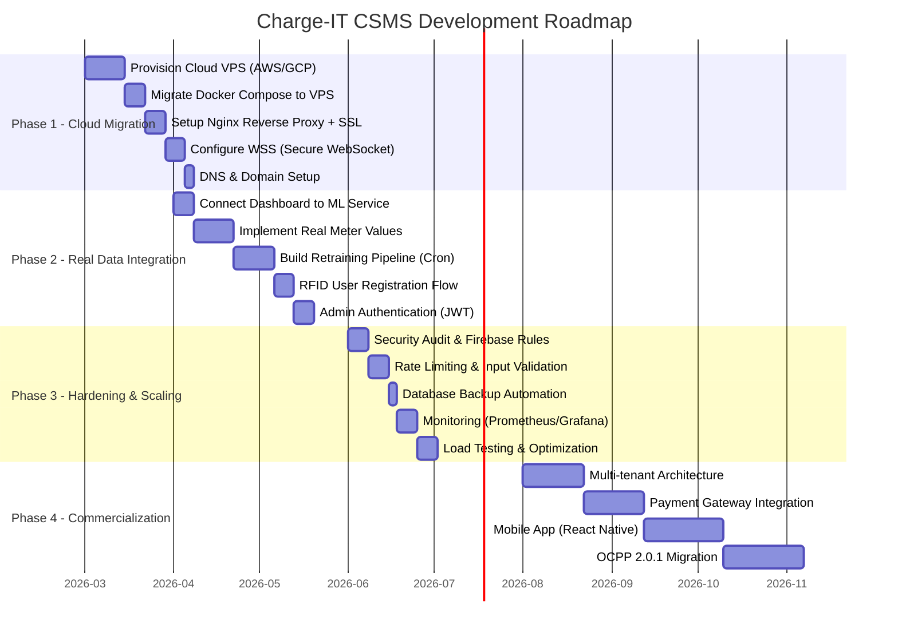

# 🗺️ Roadmap & Future Plans — Charge-IT CSMS

> Honest assessment of current limitations, phased development roadmap, and detailed action plans for evolving from a TRL 4-5 prototype to a production-ready commercial system.

---

## 📋 Table of Contents

- [Current Limitations](#-current-limitations)
- [Development Roadmap](#-development-roadmap)
- [Action Plan 1: Migrate to Cloud VPS](#-action-plan-1-migrate-to-cloud-vps)
- [Action Plan 2: Implement Continuous Learning ML Pipeline](#-action-plan-2-implement-continuous-learning-ml-pipeline)
- [Action Plan 3: Security Hardening](#-action-plan-3-security-hardening)
- [Additional Enhancements](#-additional-enhancements)

---

## ⚠️ Current Limitations

### Critical Issues (Must Fix for Production)

| # | Limitation | Impact | Severity |
|---|---|---|---|
| 1 | **Local Server Dependency** | Docker stack runs on a laptop that must be physically present and powered on. Single point of failure. | 🔴 Critical |
| 2 | **No TLS/SSL Encryption** | All WebSocket (`ws://`) and HTTP traffic is unencrypted. RFID UIDs and transaction data transmitted in plaintext. | 🔴 Critical |
| 3 | **Open Firebase Rules** | Firebase Realtime Database in "test mode" — anyone with the URL can read/write data. | 🔴 Critical |
| 4 | **No User Authentication** | Admin dashboard has no login system. `Authorize` action always returns `Accepted` regardless of id_tag. | 🔴 Critical |

### Functional Limitations

| # | Limitation | Impact | Severity |
|---|---|---|---|
| 5 | **Synthetic AI Data** | Dashboard AI views use `random.randint()` dummy generators instead of real ML model predictions. | 🟡 Medium |
| 6 | **Dashboard ↔ ML Disconnect** | The `dashboard/app.py` calls `get_smart_features_dummy()` instead of the actual `ml-service` API endpoints. | 🟡 Medium |
| 7 | **Simulated Meter Values** | Raspberry Pi sends hardcoded `meter_stop=5000` (5 kWh). No integration with real energy meter hardware (CT sensor/smart meter). | 🟡 Medium |
| 8 | **Single Demo User** | Only 1 RFID user (`DEMO-123`) in database. No dynamic user registration or RFID provisioning flow. | 🟡 Medium |
| 9 | **No MeterValues During Charging** | System only sends `StartTransaction` and `StopTransaction` — no periodic `MeterValues` during the charging session. | 🟢 Low |
| 10 | **Settings Page Not Functional** | Tariff, power limit, and RFID user management UI exists but doesn't persist changes to database. | 🟢 Low |

### Infrastructure Limitations

| # | Limitation | Detail |
|---|---|---|
| 11 | **No CI/CD Pipeline** | No automated build, test, or deployment process. |
| 12 | **No Monitoring/Alerting** | No Prometheus/Grafana, no health check endpoints for container orchestration. |
| 13 | **No Database Backup** | MariaDB data exists only in Docker volume — no scheduled backup or replication. |
| 14 | **No Rate Limiting** | API endpoints have no throttling — vulnerable to abuse. |
| 15 | **No Logging Aggregation** | Logs exist per-container only — no centralized logging (ELK/Loki). |

---

## 📅 Development Roadmap



### Phase 1: Cloud Migration (TRL 5 → 6)

**Goal:** Eliminate the laptop dependency by deploying the Docker stack to a cloud VPS with proper networking.

| Deliverable | Description |
|---|---|
| Cloud VPS Running | All 5 containers operational on AWS EC2 / GCP Compute Engine |
| WSS Enabled | WebSocket communication encrypted via TLS (wss://) |
| Public Dashboard | Admin dashboard accessible via HTTPS with a real domain |
| Raspi connects to Cloud | Raspberry Pi connects to cloud VPS instead of local laptop |

### Phase 2: Real Data Integration (TRL 6 → 7)

**Goal:** Replace all synthetic/dummy data with real ML predictions and implement missing functional features.

| Deliverable | Description |
|---|---|
| Live ML Predictions | Dashboard fetches from `ml-service` API instead of `random.randint()` |
| Real Energy Metering | CT sensor or smart meter → Raspberry Pi → periodic `MeterValues` |
| Automated Model Retraining | Cron job retrains models daily/weekly as new data accumulates |
| User Management | RFID registration, balance tracking, access control via database |

### Phase 3: Hardening & Scaling (TRL 7 → 8)

**Goal:** Production-ready security, reliability, and observability.

| Deliverable | Description |
|---|---|
| Admin Login (JWT) | Token-based authentication for dashboard access |
| Firebase Security Rules | Restrict read/write to authenticated charger nodes only |
| Database Backup | Automated daily backup to cloud storage (S3/GCS) |
| Monitoring Stack | Prometheus metrics + Grafana dashboards + alert rules |

### Phase 4: Commercialization (TRL 8 → 9)

**Goal:** Multi-site deployment capability with payment processing.

| Deliverable | Description |
|---|---|
| Multi-tenant | Single CSMS managing multiple SPKLU locations |
| Payment Integration | QR-based payment (QRIS), prepaid balance, or subscription model |
| Mobile App | React Native app replacing the Netlify static site |
| OCPP 2.0.1 | Migrate to newer protocol with Device Management and ISO 15118 support |

---

## 🚀 Action Plan 1: Migrate to Cloud VPS

### Objective

Move the Docker stack from a local laptop to a cloud Virtual Private Server, enabling 24/7 uptime and remote access for both Raspberry Pi charge points and admin users.

### Step 1.1: Provision a Cloud VPS

**Recommended:** AWS EC2 `t3.medium` (2 vCPU, 4GB RAM) or GCP `e2-medium`

```bash
# AWS CLI example
aws ec2 run-instances \
  --image-id ami-0abcdef1234567890 \  # Ubuntu 22.04 LTS
  --instance-type t3.medium \
  --key-name my-key-pair \
  --security-group-ids sg-xxxxxxxx \
  --tag-specifications 'ResourceType=instance,Tags=[{Key=Name,Value=csms-server}]'
```

**Inbound Security Group Rules:**

| Port | Protocol | Source | Purpose |
|---|---|---|---|
| 22 | TCP | Your IP | SSH access |
| 80 | TCP | 0.0.0.0/0 | HTTP (redirect to HTTPS) |
| 443 | TCP | 0.0.0.0/0 | HTTPS (Dashboard + API) |
| 9000 | TCP | 0.0.0.0/0 | WSS (OCPP WebSocket) |

### Step 1.2: Install Docker on VPS

```bash
# SSH into VPS
ssh -i my-key.pem ubuntu@<VPS_PUBLIC_IP>

# Install Docker
curl -fsSL https://get.docker.com -o get-docker.sh
sudo sh get-docker.sh
sudo usermod -aG docker ubuntu

# Install Docker Compose
sudo curl -L "https://github.com/docker/compose/releases/latest/download/docker-compose-$(uname -s)-$(uname -m)" -o /usr/local/bin/docker-compose
sudo chmod +x /usr/local/bin/docker-compose

# Verify
docker --version
docker-compose --version
```

### Step 1.3: Deploy the Docker Stack

```bash
# Clone repository to VPS
git clone <your-repo-url> /opt/csms
cd /opt/csms/CSMS-server-docker-ocpp/docker-ocpp

# Deploy
docker-compose up --build -d
```

### Step 1.4: Setup Nginx Reverse Proxy with SSL

```bash
# Install Nginx and Certbot
sudo apt install nginx certbot python3-certbot-nginx -y
```

Create Nginx configuration:

```bash
sudo nano /etc/nginx/sites-available/csms
```

```nginx
# HTTP → HTTPS redirect
server {
    listen 80;
    server_name csms.yourdomain.com;
    return 301 https://$server_name$request_uri;
}

# HTTPS — Admin Dashboard
server {
    listen 443 ssl;
    server_name csms.yourdomain.com;

    ssl_certificate /etc/letsencrypt/live/csms.yourdomain.com/fullchain.pem;
    ssl_certificate_key /etc/letsencrypt/live/csms.yourdomain.com/privkey.pem;
    ssl_protocols TLSv1.2 TLSv1.3;

    # Dashboard (port 3500)
    location / {
        proxy_pass http://127.0.0.1:3500;
        proxy_set_header Host $host;
        proxy_set_header X-Real-IP $remote_addr;
        proxy_set_header X-Forwarded-For $proxy_add_x_forwarded_for;
        proxy_set_header X-Forwarded-Proto $scheme;
    }

    # REST API (port 5050)
    location /api/ {
        proxy_pass http://127.0.0.1:5050/;
        proxy_set_header Host $host;
        proxy_set_header X-Real-IP $remote_addr;
    }
}

# WSS — OCPP WebSocket (port 9000)
server {
    listen 9443 ssl;
    server_name csms.yourdomain.com;

    ssl_certificate /etc/letsencrypt/live/csms.yourdomain.com/fullchain.pem;
    ssl_certificate_key /etc/letsencrypt/live/csms.yourdomain.com/privkey.pem;
    ssl_protocols TLSv1.2 TLSv1.3;

    location / {
        proxy_pass http://127.0.0.1:9000;
        proxy_http_version 1.1;
        proxy_set_header Upgrade $http_upgrade;
        proxy_set_header Connection "Upgrade";
        proxy_set_header Host $host;
        proxy_set_header X-Real-IP $remote_addr;
        proxy_read_timeout 86400;  # 24 hours for long-lived WS connections
    }
}
```

```bash
# Enable site
sudo ln -s /etc/nginx/sites-available/csms /etc/nginx/sites-enabled/
sudo nginx -t
sudo systemctl restart nginx

# Get SSL certificate (free via Let's Encrypt)
sudo certbot --nginx -d csms.yourdomain.com
```

### Step 1.5: Update Raspberry Pi Configuration

After cloud deployment, update the Raspberry Pi client to point to the cloud:

```python
# In rfid_cp_1_firebase.py or rfid_cp_1_f2.py:

# BEFORE (local laptop):
SERVER_IP = "192.168.137.1"
SERVER_PORT = "9000"

# AFTER (cloud VPS with WSS):
SERVER_URL = "wss://csms.yourdomain.com:9443"  # Secure WebSocket
```

Update the WebSocket connection code:

```python
# BEFORE:
async with websockets.connect(f"ws://{SERVER_IP}:{SERVER_PORT}/{CP_ID}", subprotocols=["ocpp1.6"]) as ws:

# AFTER:
import ssl
ssl_context = ssl.create_default_context()
async with websockets.connect(f"wss://csms.yourdomain.com:9443/{CP_ID}", subprotocols=["ocpp1.6"], ssl=ssl_context) as ws:
```

---

## 🤖 Action Plan 2: Implement Continuous Learning ML Pipeline

### Objective

Replace the `get_smart_features_dummy()` function in the dashboard with real ML model predictions, and establish an automated retraining pipeline that improves as real charging data accumulates.

### Step 2.1: Connect Dashboard to ML Service

The ML service already exposes the necessary endpoints. The dashboard currently bypasses them. Here's the fix:

**Current (Dummy):** `dashboard/app.py` → `get_smart_features_dummy()`

**Target (Real):** `dashboard/app.py` → `httpx.get(API_URL + "/predict/...")` → `api-service` → `ml-service`

```python
# Replace get_smart_features_dummy() in dashboard/app.py with:

async def get_smart_features_real(client):
    """Fetch real predictions from ML service via API gateway."""
    try:
        # Load Forecast
        load_resp = await client.get(f"{API_URL}/predict/availability", params={"hours": 24})
        load_data = load_resp.json() if load_resp.status_code == 200 else None

        # Health Score
        health_resp = await client.get(f"{API_URL}/health/score")
        health_data = health_resp.json() if health_resp.status_code == 200 else None

        # Format for Chart.js
        forecast_hours = [f"{i}:00" for i in range(24)]
        forecast_values = load_data.get("forecast", [0]*24) if load_data else [0]*24

        health_score = health_data.get("score", 0) if health_data else 0

        return {
            "load_forecast": {
                "labels": forecast_hours,
                "data": forecast_values
            },
            "health_status": {
                "score": round(health_score),
                "anomalies": []
            },
            "availability": {
                "data": forecast_values[:7]  # Use first 7 as weekly proxy
            }
        }
    except Exception as e:
        print(f"ML Service error: {e}, falling back to dummy data")
        return get_smart_features_dummy()  # Graceful fallback
```

### Step 2.2: Implement Periodic MeterValues on Raspberry Pi

Currently, the Raspberry Pi only sends `meter_start=0` and `meter_stop=5000`. For real ML training data, implement periodic meter updates:

```python
# Add to RealChargePoint class in rfid_cp_1_firebase.py:

async def send_meter_values_loop(self):
    """Send periodic MeterValues every 30 seconds during charging."""
    meter = 0
    while self.is_charging:
        await asyncio.sleep(30)
        if not self.is_charging:
            break
        
        # In production: read from actual CT sensor / energy meter
        # For now: simulate progressive energy accumulation
        meter += 500  # 0.5 kWh per 30s ≈ 60 kW power
        
        await self.call(call.MeterValues(
            connector_id=1,
            meter_value=[{
                "timestamp": datetime.utcnow().isoformat() + "Z",
                "sampled_value": [
                    {"value": str(meter), "measurand": "Energy.Active.Import.Register", "unit": "Wh"}
                ]
            }]
        ))
```

### Step 2.3: Automated Model Retraining Pipeline

Create a cron-based retraining system:

```python
# New file: ml-service/retrain_cron.py

import asyncio
import schedule
import time
from train import train_all

def retrain_job():
    """Retrain all models with latest data."""
    print(f"[{time.strftime('%Y-%m-%d %H:%M:%S')}] Starting scheduled retrain...")
    asyncio.run(train_all())
    print("Retrain complete.")

# Schedule retraining
schedule.every().day.at("02:00").do(retrain_job)      # Daily at 2 AM
schedule.every().sunday.at("03:00").do(retrain_job)    # Weekly deep retrain

if __name__ == "__main__":
    print("ML Retrain Scheduler started. Waiting for scheduled time...")
    while True:
        schedule.run_pending()
        time.sleep(60)
```

Add to Docker setup:

```yaml
# In docker-compose.yaml, add to ml-service:
ml-retrain:
  build: ./ml-service
  container_name: ocpp-ml-retrain
  environment:
    - DB_HOST=db
    - DB_USER=energy
    - DB_PASS=energypass
    - DB_NAME=ocpp
  depends_on:
    - db
  command: ["python", "retrain_cron.py"]
  volumes:
    - ./ml-service/models:/app/models
```

### Step 2.4: Model Performance Monitoring

Add a model evaluation endpoint to track prediction accuracy over time:

```python
# Add to ml-service/api.py:

@app.get("/model/metrics")
async def model_metrics():
    """Return model performance metrics for monitoring."""
    df_tx = await load_transactions()
    if df_tx.empty:
        return {"error": "No data"}
    
    # Compare last 24h predictions vs actuals
    model = load_model('load_lr')
    if model:
        recent = df_tx.tail(20)
        X_test = recent[['duration']].fillna(0)
        y_test = recent['kwh'].fillna(0)
        y_pred = model.predict(X_test)
        mae = mean_absolute_error(y_test, y_pred)
        return {
            "load_model_mae": round(mae, 4),
            "sample_size": len(recent),
            "last_trained": os.path.getmtime(os.path.join(MODEL_DIR, 'load_lr.pkl'))
        }
    return {"error": "Model not found"}
```

---

## 🔒 Action Plan 3: Security Hardening

### Objective

Implement industry-standard security practices across all layers to protect user data, prevent unauthorized access, and ensure safe operation of physical charging infrastructure.

### Step 3.1: Implement TLS/SSL Across All Communication

#### a) WebSocket: `ws://` → `wss://`

Already covered in **Action Plan 1, Step 1.4** (Nginx SSL termination). The OCPP WebSocket connections will be encrypted end-to-end:

```
Raspberry Pi ──[wss://]──▶ Nginx (SSL termination) ──[ws://]──▶ OCPP Server container
```

#### b) Inter-Container Communication

For production, enable TLS between Docker containers:

```yaml
# docker-compose.yaml — add to each service:
environment:
  - DB_SSL=true  # Enable MySQL SSL
```

### Step 3.2: Secure Firebase Realtime Database Rules

Replace the open test-mode rules with strict access control:

```json
{
  "rules": {
    "chargers": {
      "$charger_id": {
        // Only authenticated chargers can write to their own node
        ".write": "auth != null && auth.uid == $charger_id",
        
        // Anyone can read (for the public user HMI)
        // OR restrict to authenticated users:
        ".read": true,
        
        // Validate data structure
        ".validate": "newData.hasChildren(['uid', 'status', 'last_updated'])",
        
        "status": {
          ".validate": "newData.val() == 'STANDBY' || newData.val() == 'CHARGING' || newData.val() == 'FINISHED' || newData.val() == 'FAULT'"
        }
      }
    },
    // Deny all other paths
    "$other": {
      ".read": false,
      ".write": false
    }
  }
}
```

To authenticate the Raspberry Pi with Firebase:

```python
# Use Firebase Admin SDK with service account
import firebase_admin
from firebase_admin import credentials, db

cred = credentials.Certificate("/path/to/serviceAccountKey.json")
firebase_admin.initialize_app(cred, {
    "databaseURL": FIREBASE_URL
})

def update_firebase_secure(status, uid="N/A", power="0.0", energy="0.0"):
    ref = db.reference(f"/chargers/{FIREBASE_NODE}")
    ref.set({
        "uid": uid,
        "status": status,
        "power": f"{power} kW",
        "energy": f"{energy} kWh",
        "last_updated": datetime.utcnow().isoformat()
    })
```

### Step 3.3: Add Admin Authentication to Dashboard

Implement JWT-based authentication for the admin dashboard:

```python
# New file: dashboard/auth.py

from fastapi import Depends, HTTPException, status
from fastapi.security import HTTPBearer, HTTPAuthorizationCredentials
import jwt
import os

SECRET_KEY = os.getenv("JWT_SECRET", "change-me-in-production")
ALGORITHM = "HS256"

security = HTTPBearer()

ADMIN_USERS = {
    "admin": {
        "password_hash": "$2b$12$...",  # bcrypt hash
        "role": "admin"
    }
}

def verify_token(credentials: HTTPAuthorizationCredentials = Depends(security)):
    try:
        payload = jwt.decode(credentials.credentials, SECRET_KEY, algorithms=[ALGORITHM])
        return payload
    except jwt.ExpiredSignatureError:
        raise HTTPException(status_code=401, detail="Token expired")
    except jwt.InvalidTokenError:
        raise HTTPException(status_code=401, detail="Invalid token")
```

### Step 3.4: Implement OCPP Authorize with Real Validation

Currently, the server always accepts all RFID tags:

```python
# CURRENT (insecure):
@on(Action.Authorize)
async def on_authorize(self, id_tag, **kwargs):
    return call_result.AuthorizePayload(id_tag_info={"status": AuthorizationStatus.accepted})
```

**Replace with database lookup:**

```python
# SECURE VERSION:
@on(Action.Authorize)
async def on_authorize(self, id_tag, **kwargs):
    async with POOL.acquire() as conn:
        async with conn.cursor(aiomysql.DictCursor) as cur:
            await cur.execute(
                "SELECT id, id_tag, name FROM users WHERE id_tag = %s",
                (id_tag,)
            )
            user = await cur.fetchone()
    
    if user:
        logger.info(f"✅ Authorized: {user['name']} ({id_tag})")
        return call_result.AuthorizePayload(
            id_tag_info={"status": AuthorizationStatus.accepted}
        )
    else:
        logger.warning(f"⛔ Rejected unknown tag: {id_tag}")
        return call_result.AuthorizePayload(
            id_tag_info={"status": AuthorizationStatus.invalid}
        )
```

### Step 3.5: API Rate Limiting

```python
# Add to api-service/api.py:

from slowapi import Limiter
from slowapi.util import get_remote_address

limiter = Limiter(key_func=get_remote_address)

@app.get("/cps")
@limiter.limit("30/minute")
async def get_cps(request: Request):
    # ... existing code
```

### Step 3.6: Security Checklist

| # | Task | Priority | Status |
|---|---|---|---|
| 1 | Enable HTTPS/WSS via Nginx + Let's Encrypt | 🔴 Critical | ⬜ Todo |
| 2 | Lock down Firebase rules | 🔴 Critical | ⬜ Todo |
| 3 | Implement real OCPP Authorize (DB lookup) | 🔴 Critical | ⬜ Todo |
| 4 | Add JWT auth to admin dashboard | 🔴 Critical | ⬜ Todo |
| 5 | Use environment variables for all secrets | 🟡 High | ⬜ Todo |
| 6 | Add API rate limiting | 🟡 High | ⬜ Todo |
| 7 | Enable MySQL SSL connections | 🟡 High | ⬜ Todo |
| 8 | Input validation & SQL parameterization audit | 🟡 High | ⬜ Todo |
| 9 | Docker image vulnerability scanning | 🟢 Medium | ⬜ Todo |
| 10 | CORS policy restriction (remove `allow_origins=["*"]`) | 🟢 Medium | ⬜ Todo |
| 11 | Container non-root user enforcement | 🟢 Medium | ⬜ Todo |
| 12 | Log sanitization (remove UID from logs) | 🟢 Medium | ⬜ Todo |

---

## 💡 Additional Enhancements

### Near-Term (Low Effort, High Impact)

| Enhancement | Description | Effort |
|---|---|---|
| **Real Authorize** | Check `id_tag` against `users` table before accepting | 1 hour |
| **Settings Persistence** | Wire settings form to POST endpoint → save to DB | 2 hours |
| **Dashboard ML Integration** | Replace dummy function with httpx calls to ML service | 2 hours |
| **RFID Registration API** | POST `/users` endpoint to register new RFID cards | 1 hour |
| **WebSocket Ping/Pong** | Add `ping_interval=20` to server for connection health | 30 min |

### Medium-Term (Research & Development)

| Enhancement | Description |
|---|---|
| **Real Energy Metering** | Integrate CT sensor (SCT-013) via ADC (ADS1115) on Raspberry Pi GPIO |
| **OCPP RemoteStartTransaction** | Allow server-initiated charging (e.g., from mobile app) |
| **OCPP RemoteStopTransaction** | Emergency stop capability from admin dashboard |
| **Multi-Connector Support** | Support multiple connectors per charge point (currently hardcoded to connector_id=1) |
| **Firmware Update (OCPP)** | Implement `UpdateFirmware` and `FirmwareStatusNotification` |

### Long-Term (Strategic)

| Enhancement | Description |
|---|---|
| **OCPP 2.0.1 Migration** | Support for ISO 15118 Plug & Charge, Device Management, improved security profiles |
| **Kubernetes Orchestration** | Replace Docker Compose with K8s for horizontal scaling |
| **GraphQL API** | Replace REST with GraphQL for flexible frontend queries |
| **Digital Twin** | Real-time 3D model of charging station infrastructure |
| **Vehicle-to-Grid (V2G)** | Bidirectional charging support for grid stabilization |

---

## 📊 Success Metrics

| Metric | Current (TRL 4-5) | Phase 1 Target | Phase 3 Target |
|---|---|---|---|
| Uptime | Laptop-dependent (~8h/day) | 99% (Cloud VPS) | 99.9% |
| Security Score | 0/12 checklist | 4/12 | 12/12 |
| ML Prediction Source | `random.randint()` | Real ARIMA/IF models | Continuously retrained |
| Supported Users | 1 (DEMO-123) | 10+ | 100+ |
| Concurrent Charge Points | 4 (tested) | 10 | 50+ |
| Data Encryption | None | TLS 1.2+ (WSS/HTTPS) | E2E with mTLS |
| Response Time (API) | ~200ms (local) | <500ms (cloud) | <100ms (CDN + cache) |

---

<p align="center">
  <i>Roadmap Document — Charge-IT CSMS v1.0</i><br>
  <i>Last Updated: February 2026</i>
</p>
